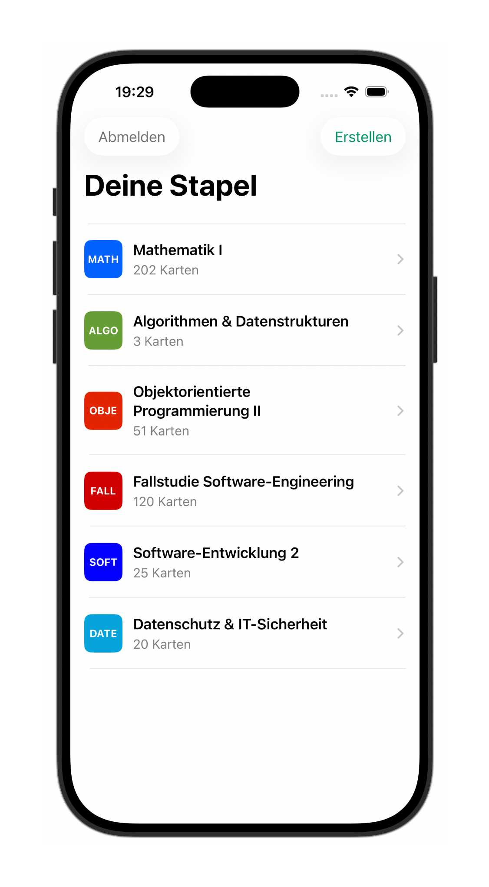
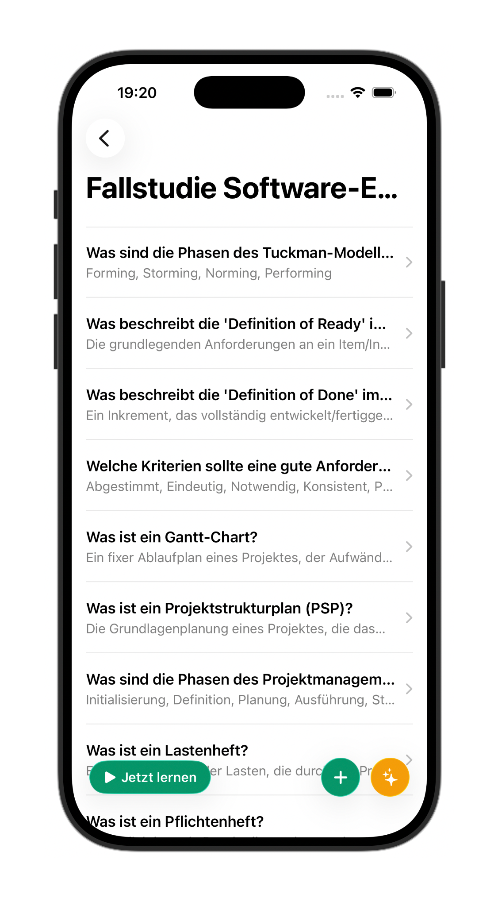
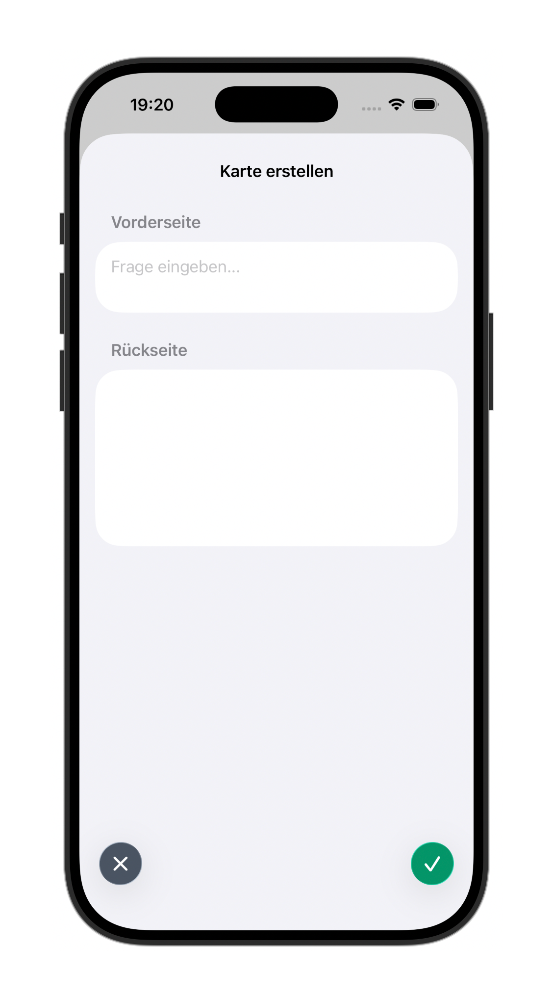
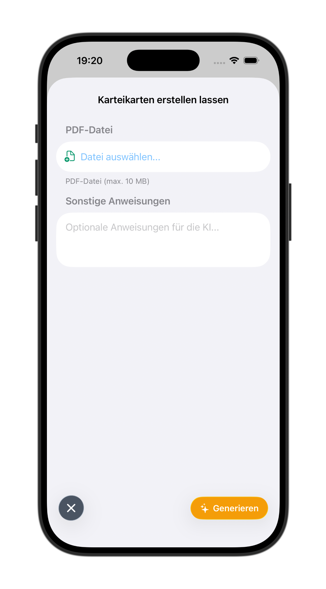
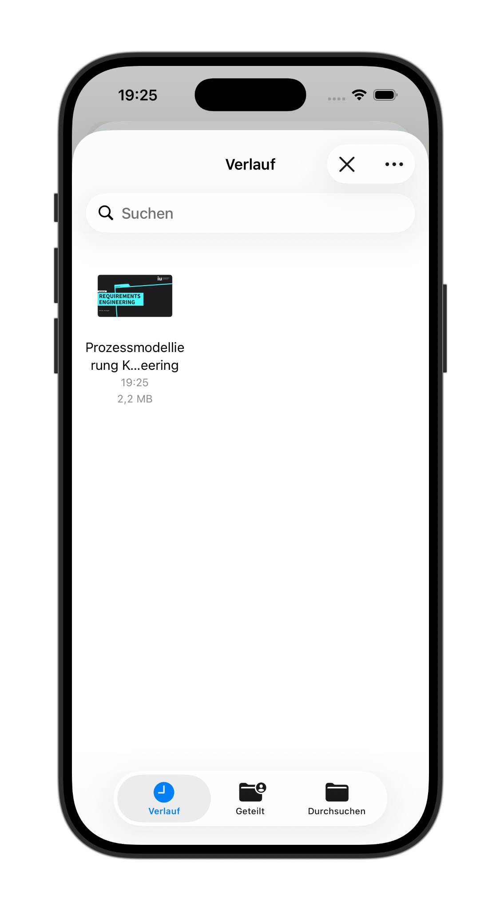
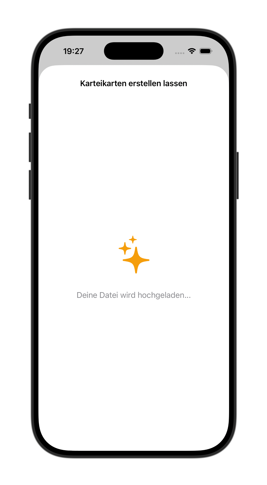

<p align="center">
  
</p>

<h1 align="center">Smart Flashcards</h1>

<p align="center">
  <strong>Learn smarter, not harder.</strong><br>
  An intelligent iOS flashcard app with AI-powered card generation.<br>
  <a href="https://www.iu.de/news/en/iu-spirit-award-2025-these-dual-students-receive-this-years-innovation-award/">IU Spirit Award 2025: These dual students receive this year's innovation award</a>
</p>

<p align="center">
  
  
  
</p>

---

## Features

- **Organize Your Knowledge** — Create and manage flashcard stacks for any subject
- **AI Card Generation** — Upload a PDF and let AI create flashcards for you automatically
- **Spaced Repetition** — Learn efficiently with smart review scheduling
- **Clean Interface** — Beautiful, distraction-free design focused on learning
- **Dark Mode** — Easy on the eyes during late-night study sessions

---

## Screenshots

<table>
  <tr>
    <td align="center"><strong>Your Stacks</strong></td>
    <td align="center"><strong>Stack Detail</strong></td>
    <td align="center"><strong>Create Card</strong></td>
  </tr>
  <tr>
    <td></td>
    <td></td>
    <td></td>
  </tr>
</table>

<table>
  <tr>
    <td align="center"><strong>AI Generation</strong></td>
    <td align="center"><strong>Upload PDF</strong></td>
    <td align="center"><strong>Processing</strong></td>
  </tr>
  <tr>
    <td></td>
    <td></td>
    <td></td>
  </tr>
</table>

---

## AI-Powered Learning

Smart Flashcards uses artificial intelligence to supercharge your study workflow:

1. **Upload any PDF** — Lecture notes, textbooks, research papers
2. **AI analyzes content** — Extracts key concepts and relationships
3. **Cards generated instantly** — Ready to review in seconds

No more hours spent manually creating cards. Focus on learning, not preparation.

---

## Getting Started

### Requirements

- iOS 17.0+
- Xcode 15.0+

### Installation

1. Clone the repository
   ```bash
   git clone https://github.com/yourusername/smart-flashcards-app.git
   ```

2. Open the project in Xcode
   ```bash
   open smart-flashcards-app.xcodeproj
   ```

3. Build and run on your device or simulator

---

## Tech Stack

| Component | Technology |
|-----------|------------|
| Frontend | SwiftUI |
| Architecture | MVVM |
| Backend | REST API |
| AI | PDF parsing + LLM |

---

## License

This project is licensed under the MIT License.

---

<p align="center">
  Made with dedication for learners everywhere.
</p>
